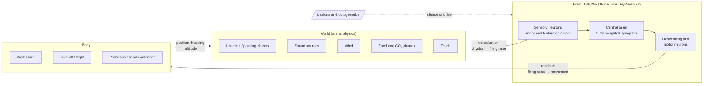

# FlyLab

**A virtual fruit fly driven entirely by a spiking simulation of its whole brain. Silence any neuron, cell type or brain region and watch its behaviour change.**

FlyLab runs all **139,255 neurons** and **2.7 million connections** of the adult *Drosophila melanogaster* brain (FlyWire FAFB v783 connectome) as leaky integrate-and-fire neurons, in real time, in the browser. The simulated brain is connected to a virtual body in a 2-D arena. You give it stimuli (an approaching object, sound, wind, touch, food, CO₂) and watch what the fly does. Then you turn off parts of the brain and see what changes.

No behaviour is scripted. There is no `if (threat) escape()`. Stimuli only set the firing rates of the fly's sensory neurons, and the body only reads the firing rates of its descending and motor neurons. Everything in between is signal propagation through the real wiring diagram.

---

## Contents

- [What it can show](#what-it-can-show)
- [Quick start](#quick-start)
- [How it works](#how-it-works)
  - [Architecture](#architecture)
  - [The brain model](#the-brain-model)
  - [World → brain: sensory transduction](#world--brain-sensory-transduction)
  - [Brain → body: motor readout](#brain--body-motor-readout)
  - [How lesions work](#how-lesions-work)
- [Project structure](#project-structure)
- [Rebuilding the connectome package](#rebuilding-the-connectome-package)
- [Running experiments from the command line](#running-experiments-from-the-command-line)
- [Data format](#data-format)
- [Performance](#performance)
- [Limitations](#limitations)
- [Ideas for extending it](#ideas-for-extending-it)
- [Credits and citations](#credits-and-citations)
- [License](#license)

For a step-by-step guide to the interface, see **[USAGE.md](USAGE.md)**.

---

## What it can show

These results come out of the wiring. Nothing in the code tells the fly to do any of them.

| Experiment | Intact brain | After the lesion | Matches biology? |
|---|---|---|---|
| Dark disc looms toward the fly from the left | Giant Fiber fires; take-off ~70–150 ms before collision | — | Yes. LPLC2 and LC4 looming detectors drive the Giant Fiber (Ache et al. 2019) |
| Same, **Giant Fiber (DNp01) silenced** | — | Fly still escapes, but through a slower "long-mode" take-off that comes too late (~500 ms) | Yes. GF-silenced flies switch to long-mode take-offs (von Reyn et al. 2014) |
| Same, **Giant Fiber + looming-responsive DNs (DNp02/04/06/11) silenced** | — | No take-off at all | Prediction |
| Looming from the left, **left optic lobe silenced** | — | Fly is blind to the threat; still escapes threats from the right | Yes |
| Sugar under the proboscis | Proboscis and ingestion motor neurons fire | — | Yes. Reproduces Shiu et al. 2024 |
| Bitter under the proboscis | Proboscis motor neurons stay silent | — | Yes |

Five trials per condition from the headless runner (`npm run lesion`). The numbers are take-off times in ms after trial start (the object is launched at t = 0 and would hit at ~476 ms). `GF` = Giant-Fiber take-off, `LM` = long-mode take-off:

```
intact             loomL  379GF 403GF 370GF 406GF 392GF
GF silenced        loomL  502LM 502LM 499LM 496LM 500LM
LPLC2+LC4 silenced loomL  433GF 433GF 439GF 438GF 429GF
left optic lobe    loomL  none  none  none  none  none
left optic lobe    loomR  365GF 325GF 359GF 356GF 345GF
GF + looming DNs   loomL  none  none  none  none  none
```

---

## Quick start

You need:

- a modern browser (Chrome, Edge, Firefox, or Safari 16.4+)
- **one** of: Python 3, or Node.js 18+

**1. Get the code**

```bash
git clone https://github.com/PiyushSatyarthi/flylab.git
cd flylab
```

(Or unzip the release and `cd` into the `flylab` folder.)

**2. Start a local web server** from the `flylab` folder, using whichever you have:

| You have | Run |
|---|---|
| Python + npm | `npm start` |
| Python only (macOS / Linux) | `python3 -m http.server 8000 --directory app` |
| Python only (Windows) | `python -m http.server 8000 --directory app` |
| Node only | `npx serve app -l 8000` |

**3. Open <http://localhost:8000>** in your browser.

The page downloads about 14 MB of connectome data and builds the brain, which takes a few seconds. Then the fly appears in the arena. Click **From left** under the stimulus bar and watch it escape.

To stop the server, press `Ctrl + C` in the terminal. If port 8000 is busy, use another port (e.g. `8080`) in the command and the address.

> Opening `app/index.html` straight from disk (`file://`) will not work. Browsers block Web Workers and `fetch()` there. Always use a server.

To host it, push the `app/` folder to GitHub Pages, Netlify, or any static host. No backend is needed.

---

## How it works

### Architecture



The loop runs at **1 ms steps** inside a Web Worker: the world computes what each sensor experiences, the brain integrates one millisecond, the body reads motor output and moves, and the world updates. The page only draws what the worker sends.

### The brain model

Every neuron is a current-based leaky integrate-and-fire unit. The parameters follow the whole-brain model of [Shiu et al. 2024](https://doi.org/10.1038/s41586-024-07763-9), which showed that such a model predicts real feeding and grooming circuits:

| Parameter | Value |
|---|---|
| Resting potential / threshold | −52 mV / −45 mV |
| Membrane time constant | 20 ms |
| Synaptic time constant | 5 ms |
| Refractory period | ≈2 ms |
| Synaptic delay | ≈2 ms |
| Weight per synapse | 0.275 mV × synapse count |
| Sign | from the **presynaptic neuron's** transmitter: acetylcholine excites; GABA, glutamate and histamine inhibit; dopamine, serotonin, octopamine and tyramine are treated as excitatory |
| Integration | Euler, dt = 1 ms, event-driven active set |

**Transmitter identity** uses the literature-verified transmitter (`known_nt` in the FlyWire annotations) where one exists, and otherwise the neuron-level machine prediction (Eckstein et al. 2024). Per-synapse predictions are not used: they mislabel some well-known cholinergic inputs, for example LPLC2 → Giant Fiber, as glutamatergic.

**Two additions to the Shiu et al. model**, both generic and applied identically to every neuron:

- **Short-term synaptic depression** (Tsodyks–Markram, U = 0.1, τ_rec = 200 ms). Without it, a 30-neuron antennal-lobe cluster (lLN1_bc) whose transmitter is predicted as acetylcholine locks into permanent 330 Hz firing after any odour, and the whole mushroom body follows.
- **Spike-frequency adaptation** (+1 mV per spike, τ = 300 ms).

Both can be changed or switched off in the Model tab.

### World → brain: sensory transduction

The world sets the Poisson firing rate of identified sensory neurons. This is the only place where physics becomes neural activity.

| Channel | Neurons | Driven by |
|---|---:|---|
| LPLC2, LC4, LPLC1, LC6 looming detectors | 210, 104, 140, 125 | Angular expansion rate of objects inside each neuron's receptive field |
| LC11, LC10a small-object detectors | 127, 234 | Small objects (< 25°) moving across the receptive field |
| Photoreceptors R1–R8 (optional "pure retina" mode) | 11,118 | Local darkening and brightening |
| Johnston's organ A / B / D (hearing) | 99 / 260 / 53 | Near-field sound, tuned to high / song-band / middle frequencies; louder on the side facing the source |
| Johnston's organ C / E (wind) | 96 / 337 | Arista pushed or pulled by wind |
| Head, eye and antennal bristles | 305, 1,112, 41 | Touch |
| Food-odour receptor neurons (DM1–4, DP1m, VA2, VM2) | 359 | Odour concentration at each antenna |
| CO₂ receptor neurons (V glomerulus) | 67 | CO₂ concentration |
| Sugar/water and bitter taste neurons (labellum) | 129, 65 | Head over a food drop |

**Receptive fields are derived from the connectome.** Photoreceptor positions in the lamina are mapped to visual angles. Every other optic-lobe neuron then inherits the synapse-weighted average position of its inputs, layer by layer. So each LPLC2 neuron gets its own receptive-field centre, and the left eye's detectors really do cover the left visual field (−159° to +3°).

### Brain → body: motor readout

The ventral nerve cord, which turns descending commands into leg and wing movements, is **not** part of the brain connectome. It is replaced by a fixed table (`MOTOR_MAP` in `app/engine.js`). The table never looks at stimuli or lesions. Each entry is a neuron type whose function has been shown experimentally:

| Output | Neurons | Evidence |
|---|---|---|
| Forward walking | DNp09 | Bidaye et al. 2020; Braun et al. 2024 |
| Backward walking | MDN, DNp42 | Bidaye et al. 2014; Braun et al. 2024 |
| Ipsilateral turning | DNa01, DNa02, DNb02 | Rayshubskiy et al. 2020; Yang et al. 2024; Braun et al. 2024 |
| Foreleg rubbing | DNg11 | Braun et al. 2024 |
| Escape jump (short mode) | DNp01 (Giant Fiber) | von Reyn et al. 2014 |
| Long-mode take-off | DNp02, DNp04, DNp06, DNp11 | von Reyn et al. 2014; Ache et al. 2019 (hypothesised) |
| Flight power | DNg02 (a–h) | Namiki et al. 2022 |
| Landing | DNp07, DNp10 | Ache et al. 2019 |
| Proboscis extension | proboscis and haustellum motor neurons | Shiu et al. 2024 |
| Ingestion | pharyngeal motor neurons | FlyWire annotation |
| Head yaw | neck motor neurons (left − right) | FlyWire annotation |
| Antenna position | antennal motor neurons | FlyWire annotation |

Rates are low-pass filtered (τ = 40 ms) and pass through a saturating function. A single Giant Fiber spike triggers a jump 5 ms later, because in the real fly the GF drives the jump muscle through a one-synapse pathway. After take-off a decaying "flight reflex" keeps the wings going (the tarsal reflex lives in the nerve cord). DNg02 activity adds flight power on top of that, and landing DNs reduce it.

### How lesions work

- **Silencing** a neuron clamps it: it never fires, even if it is a sensory neuron being driven by the world. Its synapses stay in the diagram but carry nothing.
- **Activating** (optogenetics mode) forces a neuron to fire at 150 Hz, like CsChrimson under red light.
- **Brain-region lesions** silence every neuron whose **input synapses** mostly sit in that neuropil, meaning the neurons that do their computing there. Sensory afferents, which have no inputs in the brain, are assigned by their outputs instead. With this rule, silencing the lobula takes out the LPLC2 and LC4 detectors whose dendrites are there, as a real lesion would.
- **Experiments** start a fresh fly for every trial. Trial *k* uses the same random seed in every condition, so the comparison is paired and differences come from the manipulation, not from noise.

---

## Project structure

```
flylab/
├── app/                       ← the whole web app; serve this folder
│   ├── index.html             UI: arena, fly's-eye view, motor readout, lesion / experiment / brain / model tabs
│   ├── sim-worker.js          Web Worker: live loop, stimuli, experiments, knockout screens, upstream search
│   ├── engine.js              brain + senses + body + world (runs in browser and Node)
│   ├── brain.bin.gz           connectome package (binary, gzip)
│   ├── brain.b64.txt          same package, base64 (for hosts that only serve text)
│   └── meta.json              string tables and FlyWire root IDs
├── build/
│   ├── fetch_data.sh          downloads the raw FlyWire files into data/raw/
│   ├── preprocess.py          raw FlyWire CSVs → app/brain.bin.gz, app/brain.b64.txt, app/meta.json
│   ├── test.js                stimulus battery (and helper module for the other scripts)
│   ├── lesion.js              looming-escape lesion experiment
│   ├── screen.js              optogenetic screen: which visual/sensory types drive which outputs
│   └── dev/                   diagnostics used while tuning (persistence, profiling, arousal, …)
├── data/raw/                  raw downloads (git-ignored)
├── package.json               npm scripts
├── README.md
└── USAGE.md
```

---

## Rebuilding the connectome package

`app/` already contains the built package. Rebuild it only if you change the preprocessing, for example the sign rules, the region assignment or the retinotopy.

```bash
pip install pandas numpy
npm run fetch-data     # ~90 MB into data/raw/
npm run build-data     # ~20 s; writes app/brain.bin.gz, app/brain.b64.txt, app/meta.json
```

Custom locations:

```bash
python3 build/preprocess.py --codex path/to/codex_csvs --annotations path/to/annotations.tsv --out app
```

What `preprocess.py` does:

1. Loads neurons, connections (per neuropil) and coordinates from the FlyWire Codex export, and cell types, sides and verified transmitters from Schlegel et al. 2024.
2. Assigns each neuron a transmitter and sign (verified → predicted).
3. Sums synapses per neuron pair into signed weights (CSR matrix, 2.7 M edges).
4. Assigns each neuron a region: the neuropil holding most of its input synapses.
5. Computes a receptive-field centre (azimuth, elevation) for every optic-lobe neuron by propagating photoreceptor positions through the connectome.
6. Writes the binary package and `meta.json`.

---

## Running experiments from the command line

`engine.js` runs unchanged in Node 18+, which is handy for batch experiments. Run the scripts from the repository root:

```bash
npm test               # stimulus battery: loom L/R/front, sugar, bitter, song, wind, touch, CO₂
npm run lesion         # looming escape: intact vs GF, LPLC2+LC4, left optic lobe, GF + looming DNs
npm run screen         # drive 34 sensory/visual cell types at 120 Hz; count spikes in each motor output
```

Minimal script of your own:

```js
const { b, mk, run, report } = require('./build/test.js');   // loads the connectome once

const sim = mk({ seed: 1 });                    // new fly (options: any engine param, e.g. { arousal: 3 })
sim.setSilenced(b.byType(['DNp01']));           // silence the Giant Fiber
sim.world.addLoom(sim, -90, 10);                // disc from the left, 10° elevation
run(sim, 600);                                  // 600 ms
report(sim, 'GF silenced, loom left');          // spikes per motor group, position, events
```

Useful engine calls:

| Call | Does |
|---|---|
| `b.byType(['LPLC2','LC4'])`, `b.bySub(['sugar/water'])`, `b.byPrefix('JO-')` | neuron indices by cell type, sub-class or type prefix |
| `sim.setSilenced(indices)` / `sim.setForced(indices, hz)` | lesion / optogenetic drive |
| `sim.world.addLoom(sim, az, el, {radius, speed, dist})` | looming disc (az + = fly's right) |
| `sim.world.sounds.push({x, y, freq, amp, pulsed, on: true})` | speaker |
| `sim.world.food.push({x, y, r, amount: 1, kind: 'sugar'})` | food drop (`sugar`, `water`, `bitter`) |
| `sim.world.wind = {on: true, dir, speed}` | wind blowing toward angle `dir` |
| `sim.world.touch = {part: 'head', until: ms}` | touch `head`, `eyeL`, `eyeR`, `antL`, `antR` |
| `sim.tick()` | advance 1 ms |
| `sim.spikeCount[i]`, `sim.motor.gf.rateL`, `sim.body.events` | results |

---

## Data format

`brain.bin.gz` is a gzip of this little-endian layout (N = 139,255 neurons, E = 2,700,513 edges):

| Block | Type | Length | Meaning |
|---|---|---|---|
| magic | char[4] | 4 | `FLY1` |
| N, E | uint32 | 2 | counts |
| rowptr | uint32 | N + 1 | CSR row pointers (by presynaptic neuron) |
| post | uint32 | E | postsynaptic neuron index |
| w | int16 | E | signed synapse count |
| side, superclass, class, subclass, transmitter, region | uint8 | 6 × N | indices into `meta.json` tables |
| type | uint16 | N | cell-type index |
| pos | int16 | 3 × N | x, y, z in µm (FAFB space) |
| az, el | int16 | 2 × N | receptive-field centre in 0.1° (−32768 = none) |

Neuron *i* corresponds to `meta.json → root_ids[i]`, so any neuron can be looked up on [FlyWire Codex](https://codex.flywire.ai).

---

## Performance

- **Quiet brain:** far faster than real time. A 600 ms looming trial takes about 0.2 s of compute.
- **Busy brain** (odours activating the mushroom body, 20,000+ active neurons): roughly 0.5–1× real time.
- **Global arousal on:** every neuron is integrated every step, about 3× slower than real time.

The live view slows down automatically when the brain can't keep up, and the header shows the real speed. Physics is tied to simulated time, so behaviour is identical at any speed.

---

## Limitations

- **No spontaneous walking.** Real flies walk because of internal state (hunger, arousal, neuromodulators) that a wiring diagram doesn't contain. The intact model stands still until something drives DNp09. The global-arousal slider depolarises every neuron, but in practice it produces spontaneous take-offs more than walking.
- **Sound, wind and odours** reach the brain but, in the intact model, produce no movement through the mapped outputs.
- **The motor readout is hand-written.** It is literature-based and fixed, but it is a stand-in for the nerve cord.
- **Vision starts at the lobula feature detectors.** A point-neuron LIF model cannot compute motion from photoreceptors because it has no graded neurons. "Pure retina" mode is there for exploration.
- **Body touch is missing.** Touch on legs, wings and thorax is sensed in the nerve cord, which is not in the connectome.
- **No learning, hunger or fatigue.** There is no plasticity and there are no internal drives.
- **Some transmitters are wrong.** Transmitters are machine-predicted where no experiment exists.
- **Flight is simplified.** The arena is 2-D with altitude, so flight is a take-off plus a decaying flight bout.

---

## Ideas for extending it

- Replace the motor table with a ventral nerve cord connectome (MANC) and a physics body (NeuroMechFly / FlyGym).
- Feed a connectome-constrained visual model (Lappalainen et al. 2024) into the lobula instead of the analytic looming detectors.
- Add neuromodulatory state variables (hunger, arousal) that scale specific populations.
- Export experiment results as CSV.
- Run automated single-neuron screens over every neuron upstream of an output.

---

## Credits and citations

If you use FlyLab, please cite the data and models it is built on:

- Dorkenwald, S. et al. **Neuronal wiring diagram of an adult brain.** *Nature* 634, 124–138 (2024).
- Schlegel, P. et al. **Whole-brain annotation and multi-connectome cell typing of *Drosophila*.** *Nature* 634, 139–152 (2024).
- Shiu, P. K. et al. **A *Drosophila* computational brain model reveals sensorimotor processing.** *Nature* 634, 210–219 (2024).
- Eckstein, N. et al. **Neurotransmitter classification from electron microscopy images at synaptic sites in *Drosophila melanogaster*.** *Cell* 187 (2024).
- Braun, J. et al. **Descending networks transform command signals into population motor control.** *Nature* (2024).
- von Reyn, C. R. et al. **A spike-timing mechanism for action selection.** *Nat. Neurosci.* 17, 962–970 (2014).
- Ache, J. M. et al. **Neural basis for looming size and velocity encoding in the *Drosophila* giant fiber escape pathway.** *Curr. Biol.* 29, 1073–1081 (2019).
- Klapoetke, N. C. et al. **Ultra-selective looming detection from radial motion opponency.** *Nature* 551, 237–241 (2017).
- Bidaye, S. S. et al. **Neuronal control of *Drosophila* walking direction.** *Science* 344, 97–101 (2014); Bidaye, S. S. et al. **Two brain pathways initiate distinct forward walking programs in *Drosophila*.** *Neuron* (2020).
- Namiki, S. et al. **A population of descending neurons that regulates the flight motor of *Drosophila*.** *Curr. Biol.* (2022).
- Kamikouchi, A. et al. **The neural basis of *Drosophila* gravity-sensing and hearing.** *Nature* 458, 165–171 (2009).

Connectome CSVs are from the FlyWire Codex export as mirrored in [snedea/flybrain](https://github.com/snedea/flybrain). Annotations are from [flyconnectome/flywire_annotations](https://github.com/flyconnectome/flywire_annotations).

---

## License

Code: MIT (see `LICENSE`).
The connectome data is FlyWire's and is subject to FlyWire's terms of use. Cite the papers above when you use it.
